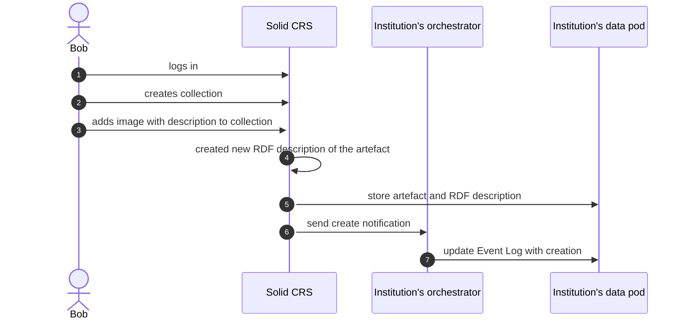

```mermaid
sequenceDiagram
        actor Bob
        participant CRS as Solid CRS
        participant BO as Institution's orchestrator
        participant BP as Institution's data pod

        autonumber
        Bob ->> CRS: logs in
        Bob ->> CRS: creates collection
        Bob ->>+ CRS: adds image with description to collection
        CRS ->> CRS: created new RDF description of the artefact

        CRS ->> BP: store artefact and RDF description
        CRS ->> BO: send create notification
        BO ->> BP: update Event Log with creation
```