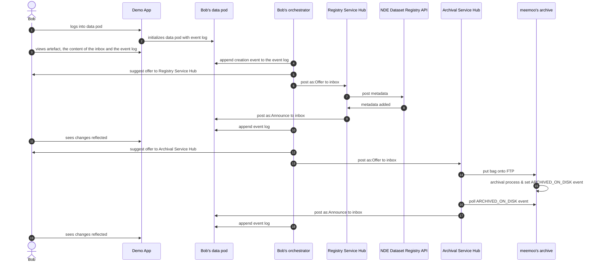

```mermaid
sequenceDiagram
    actor Bob
    participant DA as Demo App
    participant BP as Bob's data pod
    participant BO as Bob's orchestrator
    participant RSH as Registry Service Hub
    participant DR as NDE Dataset Registry API
    participant ASH as Archival Service Hub
    participant MA as meemoo's archive

    autonumber
    Bob ->> DA: logs into data pod
    DA  ->> BP: initializes data pod with event log
    Bob ->> DA: views artefact, the content of the inbox and the event log
    BO ->> BP: append creation event to the event log
    BO ->> Bob: suggest offer to Registry Service Hub
    BO ->> RSH: post as:Offer to inbox
    RSH ->> DR: post metadata
    DR ->> RSH: metadata added
    RSH ->> BP: post as:Announce to inbox
    BO ->> BP: append event log
    Bob ->> DA: sees changes reflected

    BO ->> Bob: suggest offer to Archival Service Hub
    BO ->> ASH: post as:Offer to inbox
    ASH ->> MA: put bag onto FTP
    MA ->> MA: archival process & set ARCHIVED_ON_DISK event 
    ASH ->> MA: poll ARCHIVED_ON_DISK event
    ASH ->> BP: post as:Announce to inbox
    BO ->> BP: append event log
    Bob ->> DA: sees changes reflected
```