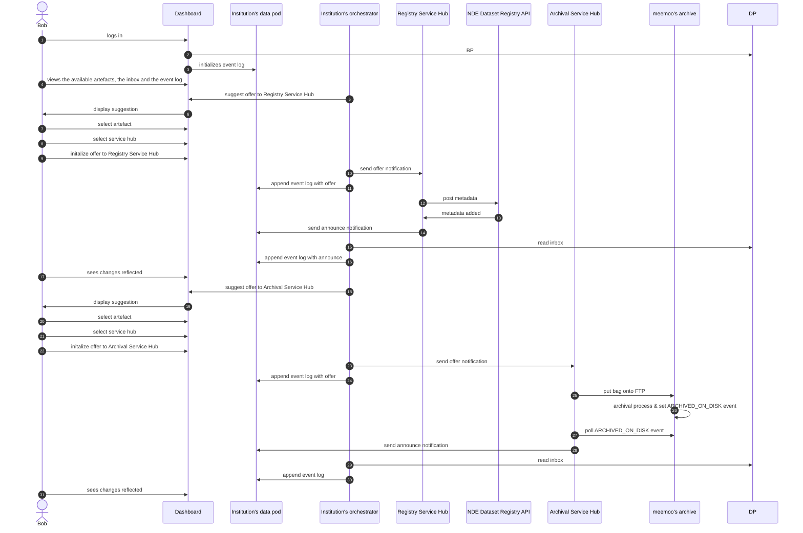

```mermaid
sequenceDiagram
    actor Bob
    participant DA as Dashboard
    participant BP as Institution's data pod
    participant BO as Institution's orchestrator
    participant RSH as Registry Service Hub
    participant DR as NDE Dataset Registry API
    participant ASH as Archival Service Hub
    participant MA as meemoo's archive

    autonumber
    Bob ->> DA: logs in
    DA ->> DP: BP
    DA  ->> BP: initializes event log
    Bob ->> DA: views the available artefacts, the inbox and the event log
    
    BO ->> DA: suggest offer to Registry Service Hub
    DA ->> Bob: display suggestion
    Bob ->> DA: select artefact
    Bob ->> DA: select service hub
    Bob ->> DA: initalize offer to Registry Service Hub
    
    BO ->> RSH: send offer notification
    BO ->> BP: append event log with offer
    RSH ->> DR: post metadata
    DR ->> RSH: metadata added
    RSH ->> BP: send announce notification
    BO ->> DP: read inbox
    BO ->> BP: append event log with announce
    Bob ->> DA: sees changes reflected

    BO ->> DA: suggest offer to Archival Service Hub
    DA ->> Bob: display suggestion
    Bob ->> DA: select artefact
    Bob ->> DA: select service hub
    Bob ->> DA: initalize offer to Archival Service Hub
    
    BO ->> ASH: send offer notification
    BO ->> BP: append event log with offer
    ASH ->> MA: put bag onto FTP
    MA ->> MA: archival process & set ARCHIVED_ON_DISK event 
    ASH ->> MA: poll ARCHIVED_ON_DISK event
    ASH ->> BP: send announce notification
    BO ->> DP: read inbox
    BO ->> BP: append event log
    Bob ->> DA: sees changes reflected
```